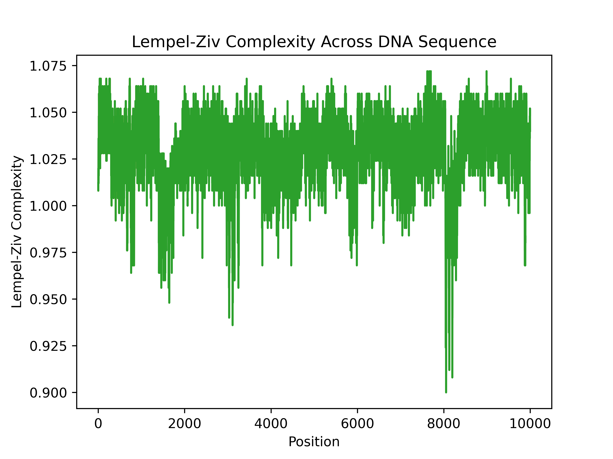

# DNA-Sequence-Compression-Analysis

Implemented the following paper https://ieeexplore.ieee.org/stamp/stamp.jsp?tp=&arnumber=6913941. 
Shannon Entroy and Statistical Complexity analysis needs to be added

# Kolmogorov Complexity (Approximated using LZ78)

- For Kolmogorov Complexity measure at 100,1000 at 10,000x 

    

      
      
      
    

- The full 5.5 Million Base Pair

  

    
  

